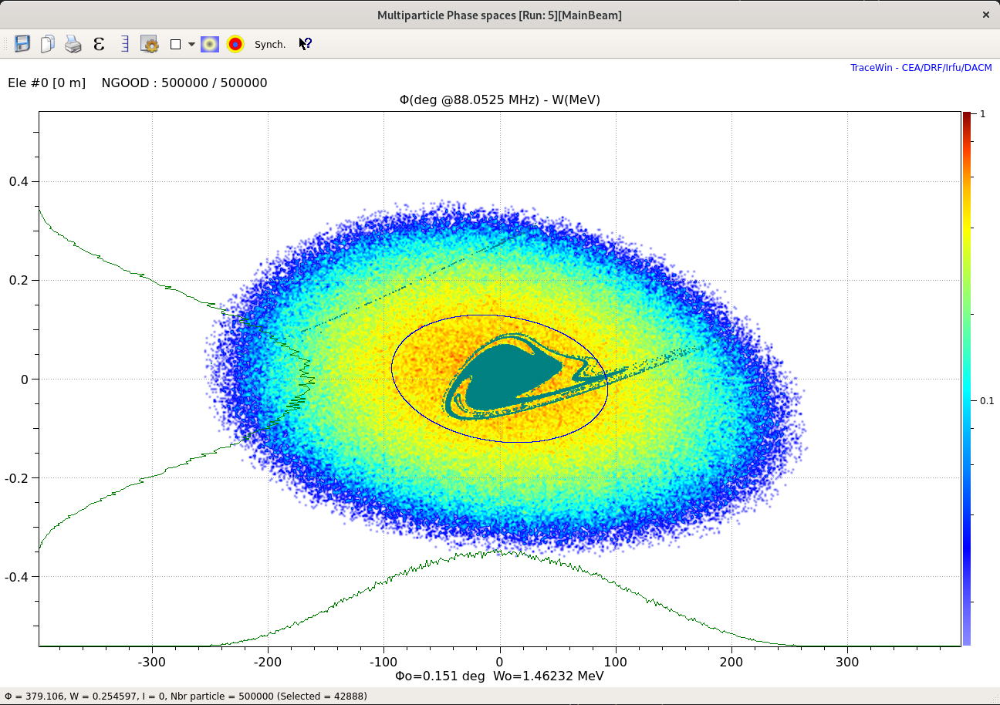

# DST-util
This small library offers tool to plot density files produced by TraceWin.
Density files are converted so that plotting them with TikZ/Pgfplot is easy.

## Installation
1. Navigate to the directory where the code should be stored and run:
`git clone git@github.com:AdrienPlacais/DST-util.git`
2. Navigate to `DST-util` folder (where this `README.md` is located), create a dedicated Python environment, activate it.
For me, it comes down to:
`python -m venv venv; source venv/bin/activate`
3. Locally install the library:
and run:
`pip install -e .`

Now you should be able to run `dst_util-gui`.

If there is any problem, open an issue and I will answer as soon as possible.

## Usage
The GUI should be straight forward.
Two modes are provided: plot of simple distributions, or plot of distributions on top of acceptance.

Note that `.dst` binary files are not supported.
You should open your `.dst` with PlotWin and convert it to non-binary `.txt` format.

### Distribution

### Acceptance
You will need a file containing either the accepted particles, either the non-accepted particles.
The TraceWin documentation explains how to produce such files.
Once you have your `accepted.dst` or `not_accepted.dst` file, reopen it with PlotWin to save it as `.txt`.

You can provide accepted particles or non-accepted particles.
In the latter case, invert acceptance colors with the checkbox for clarity.

### Integration in LaTeX documents with pgfplots
With the example `TikZ` file in the `tikz` folder, you can produce something like this.

